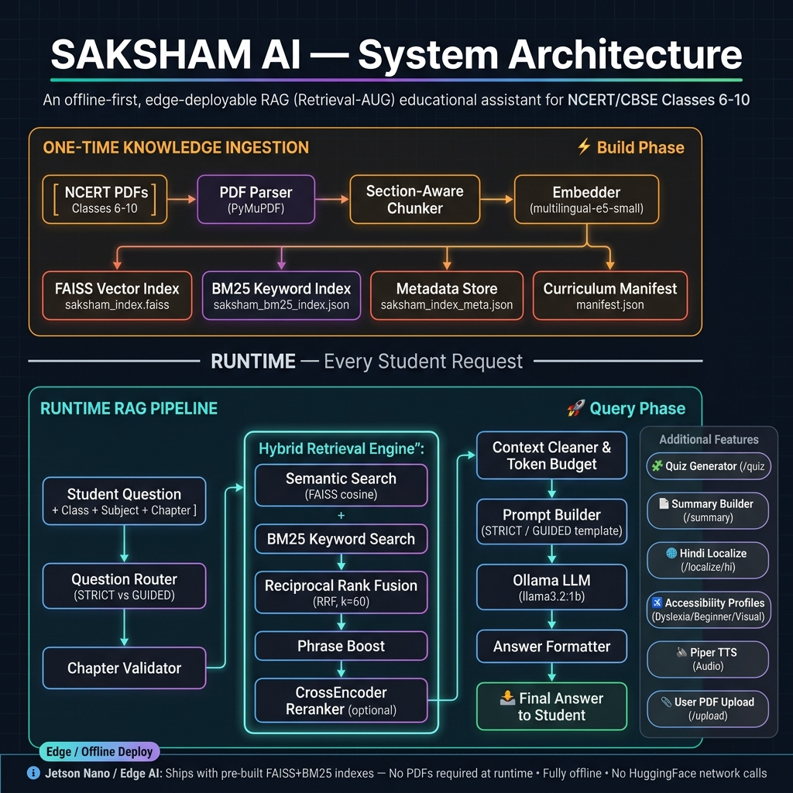

# Saksham AI — Local Offline-First Curriculum Assistant

Saksham AI is a high-performance **Retrieval-Augmented Generation (RAG)** backend designed to deliver NCERT/CBSE curriculum content (Classes 6–10) and user-uploaded documents to students in offline, low-bandwidth, or edge-computing environments (e.g., NVIDIA Jetson).

Stack: **FastAPI** + **FAISS** + **BM25** + **Ollama (`llama3.2:1b`)** + **SQLite** + **Piper TTS**

---

## System Architecture



---

## Key Features

*   **Offline Hybrid RAG (`/ask`)**: Combines semantic vector search ([multilingual-e5-small](file:///Users/mayankmaurya/Documents/SakshamAi/backend/ai/embeddings.py)) and lexical search ([BM25 Store](file:///Users/mayankmaurya/Documents/SakshamAi/backend/ai/bm25_store.py)) fused via Reciprocal Rank Fusion (RRF), boosted by phrase matching, and re-ranked using a CrossEncoder.
*   **Grounded Quiz Generation (`/quiz`)**: Builds multiple-choice quizzes from source texts using tiered extractors (Definitions, Lists, and sentence Clozes) with sequential local LLM fallback and rigorous quality gates.
*   **Multi-modal Accessibility**:
    *   *Dyslexia*: Structures responses into spaced, short bullets with inline vocabulary brackets.
    *   *Beginner*: Adapts prompts to explain concepts using analogies and everyday examples.
    *   *Visual*: Streamlines text structure and integrates Piper TTS audio generation.
*   **Educational Localization (`/localize/hi`)**: Automatically translates answers to Hindi or Hinenglish while preserving critical English scientific terms in brackets.

---

## Project Repository Layout

```text
SakshamAi/
├── .github/                            # GitHub Actions configurations
├── .gitignore                          # Root Git ignore rules
├── FEATURE_TESTING_GUIDE.md            # Complete API feature testing guide
├── SakshamAI_Postman_Collection.json   # Pre-configured Postman Collection for judges
├── README.md                           # Professional Landing Page (You Are Here)
│
└── backend/                            # FastAPI Application
    ├── .gitignore                      # Backend-specific Git ignore rules
    ├── app.py                          # Startup lifecycles, middleware & root endpoints
    ├── ARCHITECTURE.md                 # In-depth RAG & caching architectural design
    ├── exceptions.py                   # Custom HTTP exception handling
    ├── pytest.ini                      # Pytest configurations
    ├── requirements.txt                # Production python dependencies
    ├── .env.example                    # Sample environment variables template
    │
    ├── ai/                             # Retrievers, prompt templates, and formatters
    ├── api/                            # FastAPI REST routing/endpoints (/ask, /quiz...)
    ├── database/                       # SQLite DB models & repo services
    ├── docs/                           # Topic-specific documentation
    │   ├── FEATURE_TESTING_GUIDE.md    # Detailed guide for manual API validation
    │   ├── SUMMARY_FLOW.md             # Summary generation pipeline
    │   └── DYSLEXIA_TEST.md            # Dyslexia parsing specifications
    ├── documents/                      # Section-aware PDF parser and chunkers
    ├── scripts/                        # Ingest, seed, and offline model download scripts
    ├── services/                       # Core RAG, quiz, summarize, and localization logic
    └── data/                           # Local storage (FAISS, models, DB, uploads)
        ├── faiss/                      # Pre-built curriculum semantic & keyword indexes
        └── saksham_kb/
            └── manifest.json           # Catalog of class levels, subjects, & chapters
```


---

## Asset Distribution Table

To facilitate offline deployability while keeping clone times minimal, assets are distributed as follows:

| Asset | Included in Git Repo | Downloaded at Setup | Description |
| :--- | :---: | :---: | :--- |
| **FAISS Indexes & Metadata** | **Yes** | No | Pre-built vector databases for Classes 6–10. |
| **BM25 Lexical Indexes** | **Yes** | No | Tokenized keyword sidecars for hybrid retrieval. |
| **Curriculum Manifest** | **Yes** | No | Catalog listing chapter names, subjects, and stats. |
| **Sentence-Transformer Models** | No | **Yes** | Local weights for embeddings and rerankers. |
| **Ollama Model Weights** | No | **Yes** | Local weights for `llama3.2:1b`. |
| **Curriculum PDFs** | No | Optional | Raw textbook PDFs (not required at runtime). |
| **Local SQLite State** | No | No | State table created automatically on startup. |

---

## Quick Start (Local Setup)

### Prerequisites

*   Python 3.10 to 3.12 installed.
*   [Ollama](https://ollama.com/) installed and running locally.
*   **Audio Compression (Optional but Recommended)**:
    *   *macOS*: Apple's built-in `afconvert` utility is used automatically to produce `.m4a` files. If you want `.mp3` output instead, run `brew install lame`.
    *   *Linux / NVIDIA Jetson (Edge AI)*: To reduce Text-to-Speech audio sizes by over 90% (saving disk space), install `ffmpeg` or `lame` on the device:
        ```bash
        sudo apt-get install -y ffmpeg  # Complete media framework (disk space used: ~300MB)
        # OR
        sudo apt-get install -y lame    # Ultra-lightweight MP3 encoder (disk space used: <1MB)
        ```

### Step 1: Clone the Repository

```bash
git clone https://github.com/your-username/SakshamAi.git
cd SakshamAi
```

### Step 2: Initialize Virtual Environment

```bash
cd backend
python -m venv .venv
source .venv/bin/activate
pip install --upgrade pip
pip install -r requirements.txt
```

### Step 3: Configure Environment Variables

Create your local `.env` file from the example template:

```bash
cp .env.example .env
```

> [!NOTE]
> The default values in [.env.example](file:///Users/mayankmaurya/Documents/SakshamAi/backend/.env.example) are pre-configured for running Ollama on localhost and using local, offline sentence-transformers.

### Step 4: Download Embedding & Reranker Models

Download the Sentence-Transformer and CrossEncoder models locally to bypass HuggingFace network calls during runtime:

```bash
python scripts/download_models.py --verify
```

### Step 5: Start Ollama and Pull the Model

Ensure Ollama is running, then pull the target lightweight model:

```bash
ollama pull llama3.2:1b
```

### Step 6: Launch the Backend

```bash
uvicorn app:app --reload --port 8000
```

The server will initialize at `http://localhost:8000`. On startup, it will automatically:
1. Initialize the SQLite database.
2. Load the prebuilt FAISS and BM25 indexes.
3. Preload the embedding models into memory.

---

## Verification & Testing

Verify that your local deployment is fully functional by running the test suite:

```bash
# Run unit tests
pytest tests/unit -q

# Run API endpoint tests
pytest tests/api -q
```

All 154+ tests should pass successfully.

### Interactive API Testing (Postman)

To make manual verification easy, we have provided a pre-configured Postman Collection at the root of the project:

- **Collection File**: [SakshamAI_Postman_Collection.json](file:///Users/mayankmaurya/Documents/SakshamAi/SakshamAI_Postman_Collection.json)
- **Import & Setup**:
  1. Open Postman, click **Import**, and load `SakshamAI_Postman_Collection.json`.
  2. The collection is organized into folders for each feature module (Health, Browse, Ask, Summary, Quiz, Simplify, Document Pipeline, Standalone TTS, Hinenglish Localize).
  3. The `base_url` variable is pre-configured to `http://localhost:8000`.
  4. **Document Upload Testing**: After calling the upload request, copy the returned `document_id` from the response and update the `document_id` collection variable in Postman to query/quiz that specific file.

---

## Edge AI Deployment Checklist (NVIDIA Jetson)

Saksham AI supports **PDF-free execution** at the edge, allowing you to deploy onto resource-constrained hardware (e.g., Jetson Nano/Orin) without storing large curriculum PDFs.

### Deployment Directory Bundle
To deploy, copy the following directories to the edge device:
1. `backend/app.py` and backend logic (`api/`, `ai/`, `services/`, `database/`, `config/`, `documents/`).
2. `backend/data/faiss/` (contains pre-built semantic and keyword indexes).
3. `backend/data/saksham_kb/manifest.json` (metadata catalog).
4. `backend/data/models/` (pre-downloaded embedding/reranking models).
5. Local environment configurations (`.env`).

### Jetson Hardware Configuration
For 4GB Orin Nano / Jetson Nano devices, optimize RAM footprint by setting the following in `.env`:
*   `RERANK_ENABLED=false` (disables CrossEncoder reranking to save memory).
*   Ensure Ollama is set to keep models loaded (`OLLAMA_NUM_PARALLEL=1`).

---

## Detailed Documentation Links

*   **Architecture & RAG Pipeline**: For details on the ingestion workflow, reciprocol rank fusion, and question routing, see [backend/ARCHITECTURE.md](file:///Users/mayankmaurya/Documents/SakshamAi/backend/ARCHITECTURE.md).
*   **Manual Testing Reference**: To manually validate the endpoints using `curl`, consult the [backend/docs/FEATURE_TESTING_GUIDE.md](file:///Users/mayankmaurya/Documents/SakshamAi/backend/docs/FEATURE_TESTING_GUIDE.md).
*   **Product Requirements**: To read the product specification and roadmap, see [PRD.md](file:///Users/mayankmaurya/Documents/SakshamAi/PRD.md).
