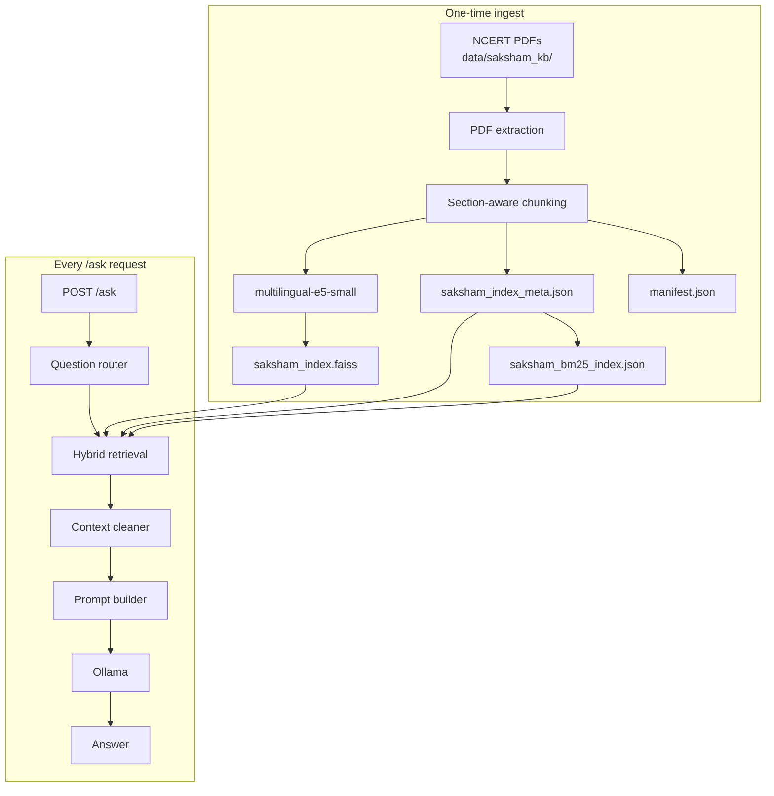

# Saksham AI Backend — Architecture

This document describes how the Saksham AI backend works end-to-end: curriculum ingestion, hybrid retrieval (Phase 1), offline deployment, and the `/ask` RAG pipeline.

---

## Overview

Saksham is a **Retrieval-Augmented Generation (RAG)** system for NCERT/CBSE curriculum (Classes 6–10).

| Phase | What happens |
|---|---|
| **Ingest (once)** | PDFs → text → chunks → embeddings → FAISS + BM25 indexes |
| **Runtime (every question)** | Question → retrieve relevant chunks → build prompt → Ollama LLM → answer |

The LLM does not memorize the curriculum. It only sees **retrieved chapter text** injected into the prompt.



---

## Data storage

| Asset | Path | Purpose |
|---|---|---|
| Source PDFs | `data/saksham_kb/class{6-10}/{subject}/*.pdf` | Raw NCERT/CBSE chapters |
| Manifest | `data/saksham_kb/manifest.json` | Chapter catalog (class, subject, title, stats) |
| FAISS index | `data/faiss/saksham_index.faiss` | Vector embeddings for semantic search |
| FAISS metadata | `data/faiss/saksham_index_meta.json` | Per-vector metadata including **full chunk text** |
| BM25 sidecar | `data/faiss/saksham_bm25_index.json` | Lexical (keyword) index grouped by chapter |
| Curriculum hash | `data/faiss/saksham_kb_hash.txt` | Detects PDF or index-version changes |
| Embedding model | `data/models/multilingual-e5-small/` (~470 MB) | Text → 384-dim vectors at runtime |
| Reranker model | `data/models/ms-marco-MiniLM-L-6-v2/` (~88 MB) | Re-ranks candidate chunks (optional) |
| LLM | Ollama (`llama3.2:1b` default) | Generates the final answer |
| User uploads | `data/faiss/user_index.*` + SQLite | Separate index for uploaded documents |

**Note:** FAISS stores vectors only. Chunk text lives in `saksham_index_meta.json` (and is duplicated in the BM25 sidecar for search).

---

## Ingest pipeline (building the knowledge base)

**Entry points:**
- `python scripts/ingest_curriculum.py --force`
- Automatic at startup via `build_saksham_index()` in `app.py`

**Core module:** `services/knowledge_service.py`

### 1. Discover chapters

`discover_chapter_pdfs()` scans `data/saksham_kb/` and builds chapter records: class, subject, `chapter_id`, title, PDF path.

### 2. Staleness check

`compute_curriculum_hash()` hashes:
- All PDF bytes under `saksham_kb/`
- `saksham_index_version` (currently `v2-section-hybrid`)

If the hash matches `saksham_kb_hash.txt` and index files exist, the pre-built index is **loaded without re-reading PDFs** (Jetson-friendly: PDFs not required at runtime).

### 3. PDF → text

`documents/pdf_parser.py` → `extract_text()` using PyMuPDF.

### 4. Section-aware chunking (Phase 1)

**Module:** `documents/chunker.py` → `create_curriculum_chunks()`

1. Split on NCERT section boundaries (`1.`, `1.4`, Summary, Exercises, Let's Discuss, etc.)
2. Chunk each section separately if it exceeds ~700 tokens (100-token overlap)

**Why:** Fixed-size chunks could mix unrelated topics (e.g. Palampur wages vs irrigation). Section-first chunking keeps related paragraphs together.

### 5. Embed and index

**Module:** `documents/indexer.py` → `index_document()`

For each chunk:
- `embed_batch()` with `intfloat/multilingual-e5-small`, prefix `"passage: ..."`
- Vector added to FAISS (`IndexFlatIP`, L2-normalized cosine similarity)
- Metadata stored in `id_map`:

```json
{
  "class": 10,
  "subject": "Geography",
  "chapter_id": "agriculture",
  "chapter_title": "Agriculture",
  "chunk_text": "...",
  "chunk_index": 3,
  "source": "saksham_curriculum"
}
```

Each chunk receives a unique **faiss_id** (0, 1, 2, …).

### 6. BM25 sidecar (Phase 1)

**Module:** `ai/bm25_store.py`

After FAISS ingest, `SakshamBM25Store.build_from_faiss_metadata()` groups chunks by chapter and builds a tokenized BM25 index. Saved to `saksham_bm25_index.json`.

### 7. Save manifest

`manifest.json` is updated with per-chapter stats (pages, words, chunk count).

---

## Backend startup

**Module:** `app.py` lifespan

1. `init_db()` — SQLite for uploads and app state
2. `build_saksham_index()` — load or rebuild curriculum index
3. `preload_embedding_model()` — load embedding model into RAM

---

## Ask pipeline (`POST /ask`)

**API:** `api/ask.py` → `services/rag_service.py` → `answer_question()`

### Request (Saksham curriculum)

```json
{
  "question": "Why are wages for farm labourers in Palampur less than minimum wages?",
  "source": "saksham",
  "class_level": 9,
  "subject": "Economics",
  "chapter": "The Story of Village Palampur",
  "mode": "learn"
}
```

Required for `source: "saksham"`: `class_level`, `subject`, `chapter` (title or `chapter_id`).

### Step 1 — Question analysis

**Module:** `ai/question_router.py`

| Decision | Logic | Effect |
|---|---|---|
| Answer profile | Activity / Figure / Exercise refs or bio question → **STRICT**; else **GUIDED** | Controls prompt strictness |
| Broad question | Matches `describe`, `explain`, `how did`, etc. | Adds structured-answer addendum |
| Retrieval `top_k` | GUIDED: 7; STRICT: 5 | Number of chunks retrieved |
| Context char limit | GUIDED: 7000; STRICT: 3200 | Max text sent to LLM |

**Module:** `ai/retriever.py` → `extract_content_refs()` for Activity, Figure, Exercise references in the question.

### Step 2 — Chapter validation

**Module:** `services/knowledge_service.py` → `validate_saksham_chapter()`

Checks manifest and that indexed chunks exist for the chapter.

### Step 3 — Retrieval

**Module:** `ai/retriever.py` → `retrieve_saksham_context()`

Scoped to **one chapter** (class + subject + chapter filter).

#### Special paths (bypass hybrid)

- **Activity questions** → full activity passage extracted from ordered chunks
- **Strong keyword match** → keyword-only mode for focused factual queries

#### Default path — Hybrid retrieval (Phase 1)

**Module:** `ai/retriever.py` → `_hybrid_retrieve_chapter()`

```
Question
   │
   ├─► Semantic search (FAISS)
   │     embed question as "query: ..."
   │     search_filtered() within chapter
   │     ~20 candidates (retrieval_candidate_count)
   │
   ├─► BM25 search (same chapter)
   │     ai/bm25_store.py → search_chapter()
   │     ~20 candidates
   │
   ├─► Reciprocal Rank Fusion
   │     ai/hybrid_search.py → reciprocal_rank_fusion()
   │     merges both ranked lists (RRF_K=60)
   │
   ├─► Phrase boost
   │     prepend chunks with exact phrase matches
   │
   └─► Optional reranker
         ai/reranker.py → CrossEncoder
         re-scores top candidates; returns top_k
```

**Fallback chain** if hybrid returns nothing: legacy semantic + keyword merge → phrase prepend → all chapter chunks in document order.

Each result is a `ChunkContext`: `{ text, score, faiss_id, metadata }`.

### Step 4 — Context preparation

**Module:** `ai/context_cleaner.py`

1. `clean_context_text()` — remove reprint tags, dot leaders
2. `clean_context_for_llm()` — strip some exercise headers
3. `trim_context_chunks()` — fit within char budget
4. `format_retrieved_chunks()` — join with `\n\n---\n\n`

**Optional shortcuts (skip LLM):**
- `ai/activity_formatter.py` — structured activity answers
- `ai/bio_formatter.py` — structured biography answers

### Step 5 — Prompt building

**Module:** `ai/prompt_builder.py`

Combines system prompt (STRICT or GUIDED), retrieved context, question, and mode-specific instructions. Broad questions get an extra addendum for structured answers.

### Step 6 — LLM generation

**Module:** `ai/llm.py` → `OllamaLLM`

- Endpoint: `OLLAMA_BASE_URL` (default `http://localhost:11434`)
- Model: `OLLAMA_MODEL` (default `llama3.2:1b`)
- Options: `temperature=0.1`, `num_ctx=8192`

### Step 7 — Post-processing

**Module:** `ai/answer_formatter.py` → `format_student_answer()`

Strips chatbot filler phrases from the LLM output.

---

## Phase 1 hybrid retrieval — summary

| Component | Module | Role |
|---|---|---|
| Section chunking | `documents/chunker.py` | Better chunk boundaries |
| BM25 store | `ai/bm25_store.py` | Keyword search per chapter |
| RRF fusion | `ai/hybrid_search.py` | Merge semantic + BM25 rankings |
| Reranker | `ai/reranker.py` | Cross-encoder re-ordering (optional) |
| Hybrid path | `ai/retriever.py` | Orchestrates the full pipeline |
| Index version | `config/settings.py` | `saksham_index_version=v2-section-hybrid` |

**Config (`.env`):**

```env
BM25_ENABLED=true
HYBRID_RETRIEVAL_ENABLED=true
RERANK_ENABLED=true
RETRIEVAL_CANDIDATE_COUNT=20
RRF_K=60
TOP_K=5
TOP_K_GUIDED=7
MAX_LLM_CONTEXT_CHARS=3200
MAX_LLM_CONTEXT_CHARS_GUIDED=7000
```

---

## Offline / Jetson deployment

| Component | Offline at runtime? | Notes |
|---|---|---|
| PDFs | Not required | Pre-built index is sufficient |
| FAISS + meta + BM25 | Yes | Ship `data/faiss/` |
| Embedding model | Yes | `EMBEDDING_MODEL_PATH=./data/models/multilingual-e5-small` |
| Reranker | Yes (optional) | `RERANK_MODEL_PATH=...` or `RERANK_ENABLED=false` on 4 GB devices |
| Ollama LLM | Yes | Install Ollama and pull model once |
| HuggingFace | No network calls | `EMBEDDING_LOCAL_FILES_ONLY=true` |

### Setup commands

```bash
# Download PyTorch-only models (~558 MB)
python scripts/download_models.py --verify

# Remove unused ONNX/OpenVino extras if present
python scripts/download_models.py --cleanup --verify

# Re-index after PDF or chunking changes
python scripts/ingest_curriculum.py --force
```

### What to copy to Jetson

- `data/models/` (~558 MB)
- `data/faiss/` (FAISS index, metadata, BM25 sidecar, hash)
- `data/saksham_kb/manifest.json` (chapter catalog; PDFs optional if index pre-built)
- Application code + `.env`

---

## Two RAG sources

| `source` | Use case | Index |
|---|---|---|
| `saksham` | NCERT/CBSE curriculum | `saksham_index` + BM25 + hybrid retrieval |
| `document` | User-uploaded PDFs | `user_index` + SQLite metadata |

Same RAG pattern; the Saksham path adds chapter scoping and hybrid retrieval.

---

## Key modules map

```
app.py                          FastAPI entry, startup lifecycle
api/ask.py                      POST /ask endpoint
services/rag_service.py         RAG orchestration
services/knowledge_service.py   Ingest, manifest, chapter APIs
ai/retriever.py                 Retrieval (hybrid + fallbacks)
ai/hybrid_search.py             RRF fusion
ai/bm25_store.py                BM25 sidecar
ai/reranker.py                  Cross-encoder reranker
ai/embeddings.py                multilingual-e5-small
ai/llm.py                       Ollama client
ai/prompt_builder.py            Prompt templates
ai/question_router.py           STRICT vs GUIDED routing
ai/context_cleaner.py           Context trimming and cleanup
documents/chunker.py            Section-aware chunking
documents/indexer.py            FAISS indexing
ai/faiss_manager.py             FAISS load/save/search
config/settings.py              Environment configuration
scripts/ingest_curriculum.py    Manual re-index
scripts/download_models.py      Bundle models for offline use
```

---

## Known limitations (current accuracy ~60–70%)

1. **Exercise-list chunks** can rank high when the question text matches an end-of-chapter exercise line.
2. **Small LLM** (`llama3.2:1b`) often produces short answers for “describe/explain” questions even when context is good.
3. **No output length control** — `num_predict` is not configured in Ollama options.
4. **Generation errors** — wrong answers can still occur when the LLM misreads or ignores retrieved context.

Retrieval fixes (Phase 1) address the largest gap vs raw LLM (~10–20% accuracy). Remaining gains are primarily LLM quality, prompt tuning, and exercise-chunk filtering.

---

## Related tests

| Test file | What it verifies |
|---|---|
| `tests/integration/test_retrieval_regression.py` | Palampur wages + electricity retrieval |
| `tests/unit/test_hybrid_search.py` | RRF fusion |
| `tests/unit/test_bm25_store.py` | BM25 ranking |
| `tests/unit/test_chunker.py` | Section chunking |
| `tests/unit/test_prompt_builder.py` | Prompt construction |
| `tests/unit/test_reranker.py` | Reranker fallback |

Run retrieval regression (requires real index and embeddings):

```bash
pytest tests/integration/test_retrieval_regression.py -m integration
```
