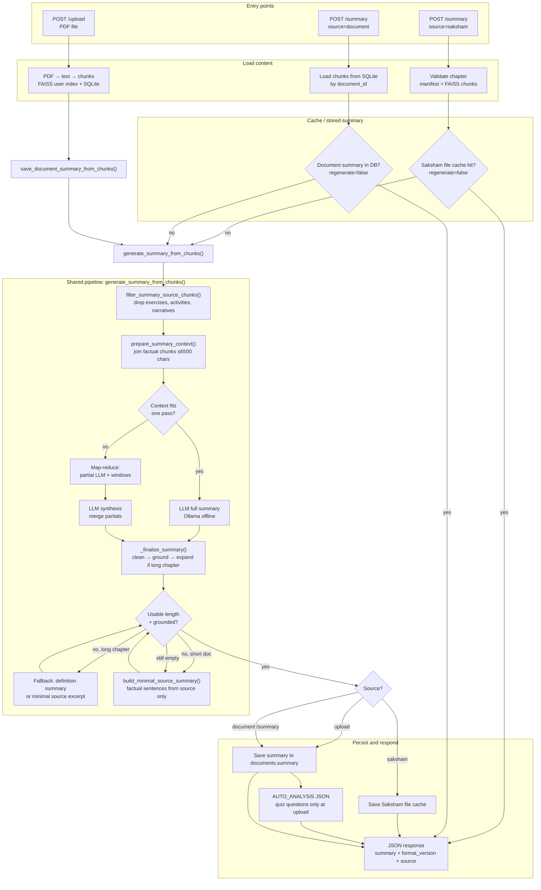

# Summary Generation Flow

Unified pipeline for **Learn from Saksham** and **uploaded documents**.  
Both paths call `generate_summary_from_chunks()` in `services/summary_service.py`.

| Entry | Function chain |
|-------|----------------|
| `POST /summary` (saksham) | `generate_saksham_summary()` → cache check → chunks from FAISS → `generate_summary_from_chunks()` |
| `POST /upload` | `process_upload()` → chunks in SQLite → **`save_document_summary_from_chunks()`** → `generate_summary_from_chunks()` |
| `POST /summary` (document) | `generate_document_summary()` → DB cache check → chunks from SQLite → **`save_document_summary_from_chunks()`** → `generate_summary_from_chunks()` |

Upload and document `/summary` both persist via `save_document_summary_from_chunks()`.

## End-to-end flowchart



## Upload vs Saksham (what is identical)

| Step | Saksham | Upload / document |
|------|---------|-------------------|
| Core function | `generate_summary_from_chunks()` | Same |
| Pre-filter | `filter_summary_source_chunks()` | Same |
| LLM prompt | Ollama prose summary | Same |
| Grounding | `ground_summary_text()` | Same |
| Short-doc fallback | `build_minimal_source_summary()` | Same |
| Long-chapter fallback | Definition-based fallback | Same |
| Cache / store | File cache per chapter | SQLite `documents.summary` |
| Quiz | Separate `POST /quiz` | AUTO_ANALYSIS at upload (questions only) |

## Response shape

```json
{
  "summary": "Paragraph one...\n\nParagraph two...",
  "format_version": "v2-prose",
  "source": "saksham",
  "cached": false
}
```

Render `summary` with paragraph breaks (`\n\n` or CSS `white-space: pre-line`).

## Key settings (`.env`)

| Variable | Purpose |
|----------|---------|
| `SUMMARY_MAX_CONTEXT_CHARS` | Single-pass vs map-reduce threshold (~6500) |
| `SUMMARY_MIN_WORDS` / `SUMMARY_TARGET_WORDS` | Length targets for full chapters |
| `OLLAMA_NUM_PREDICT_SUMMARY` | Max tokens for summary LLM calls |
| `SUMMARY_CACHE_VERSION` | Bust Saksham file cache when pipeline changes |

## Key files

| File | Role |
|------|------|
| `api/summary.py` | HTTP endpoint |
| `documents/processor.py` | Upload → `save_document_summary_from_chunks()` |
| `services/summary_service.py` | Orchestration, cache, unified chunk pipeline |
| `services/summary_context.py` | Chunk filtering + context assembly |
| `services/summary_factual.py` | Narrative strip + sentence grounding |
| `services/summary_parser.py` | Clean / dedupe prose |
| `services/summary_grounded.py` | Definition fallback + minimal source excerpt |
| `ai/prompt_builder.py` | LLM prompts |
