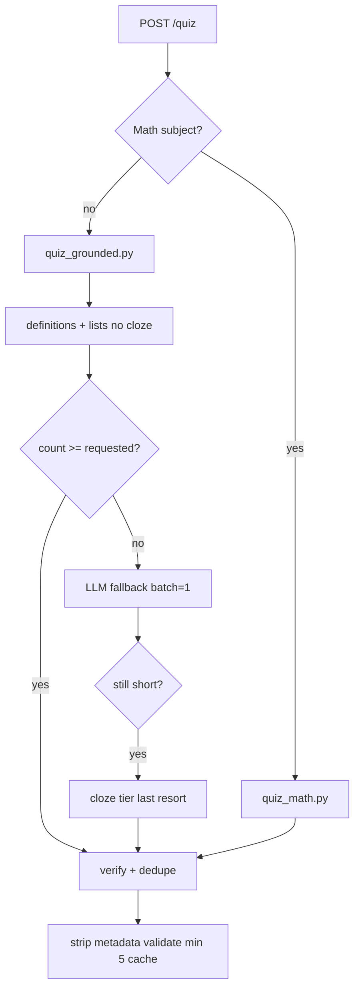

# Quiz Generation Pipeline

**Endpoint:** `POST /quiz` (`backend/api/quiz.py`)  
**Orchestrator:** `backend/services/quiz_service.py`  
**Cache version:** `v11-quality-gate` (`config/settings.py`)

## Design principle

One **generic grounded pipeline** for all non-Math subjects. No per-chapter hardcoded templates (removed from `quiz_science.py`).

Math uses `quiz_math.py` (facts, templates, chapter-kind detection).

## Flow



## Extractors (`quiz_grounded.py`)

| Tier | Function | Source type |
|------|----------|-------------|
| 1 | `extract_definition_questions` | `"is called"` / `"are called"` sentences |
| 2 | `extract_list_questions` | Numbered list items `(i)`, `(ii)`, … |
| 3 | `extract_sentence_cloze_questions` | Fill-in-blank (strict filters, last resort) |
| LLM | `_generate_questions_for_context` | `source_type: llm` via `tag_llm_questions` |

## Verification

- `verify_grounded_question(item, corpus)` — checks `source_text`, bans junk options
- `verify_llm_question(item, corpus)` — lighter corpus grounding for LLM origin
- `is_valid_grounded_question` — length, uniqueness, no `Option N`, no OCR garbage

Internal metadata `_quiz_meta` is stripped before API response (`strip_quiz_metadata`).

## Distractor rules

- **Definitions:** chapter-level definition terms + list items; phrase-pool fallback only if <3 distractors
- **Lists:** only other list items in the same chunk (not random sentence fragments)
- **Cloze:** `_is_usable_distractor` filters; reject OCR splits like `E lectricity ______`

## Cache (`quiz_cache.py`)

- Keyed by `source`, `question_count`, `chapter_id`, `class_level`, `subject`
- **Invalidates** when cached metadata does not match request (fixed stale Electricity → Acids bug)
- Clear manually: `rm -rf backend/data/quiz_cache/*`

## Chapter lookup bug (fixed)

**File:** `services/knowledge_service.py` → `get_chapter_from_manifest()`

**Bug:** `slugify(chapter_ref)` was added to every chapter’s match set → first manifest match won.

**Fix:** Match only against that chapter’s `chapter_id`, `chapter_title`, and slugified title.

## Config

```env
QUIZ_MIN_QUESTIONS=5
QUIZ_MAX_QUESTIONS=15
QUIZ_LLM_BATCH_SIZE=1
QUIZ_LLM_MAX_ATTEMPTS=5
QUIZ_CACHE_VERSION=v11-quality-gate
```

## Tests

```bash
cd backend
.venv/bin/pytest tests/unit/test_quiz_grounded.py tests/unit/test_quiz_service.py \
  tests/unit/test_quiz_science.py tests/api/test_quiz_api.py -q
```

Key assertions: no `Option N` fillers, correct `chapter_id`, min 5 questions, Electricity definition quality.

## God nodes (from graph)

Most connected quiz symbols: `build_grounded_chapter_questions`, `verify_grounded_question`, `generate_saksham_quiz`, `_generate_grounded_quiz_questions`.

Query: `graphify path "create_quiz" "build_grounded_chapter_questions"`
